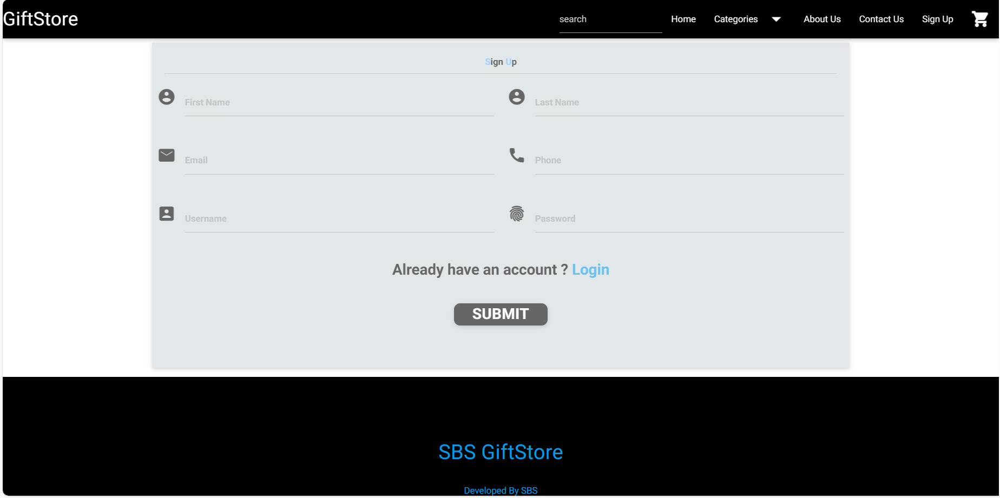
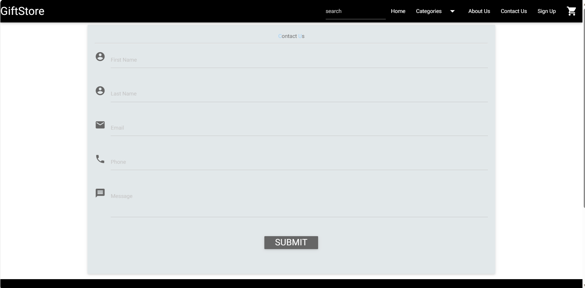
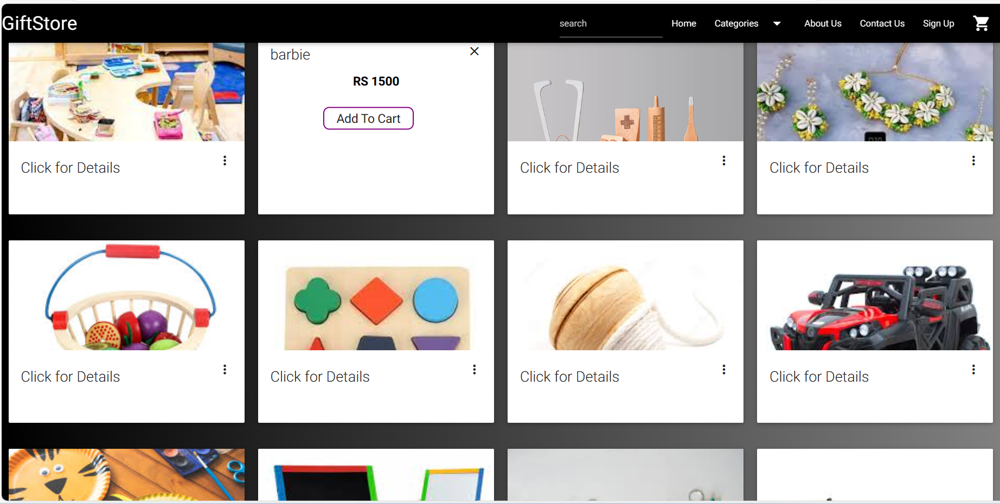
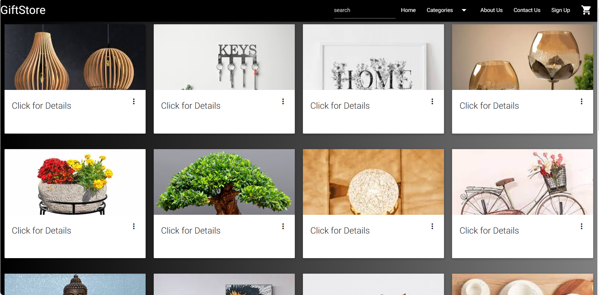
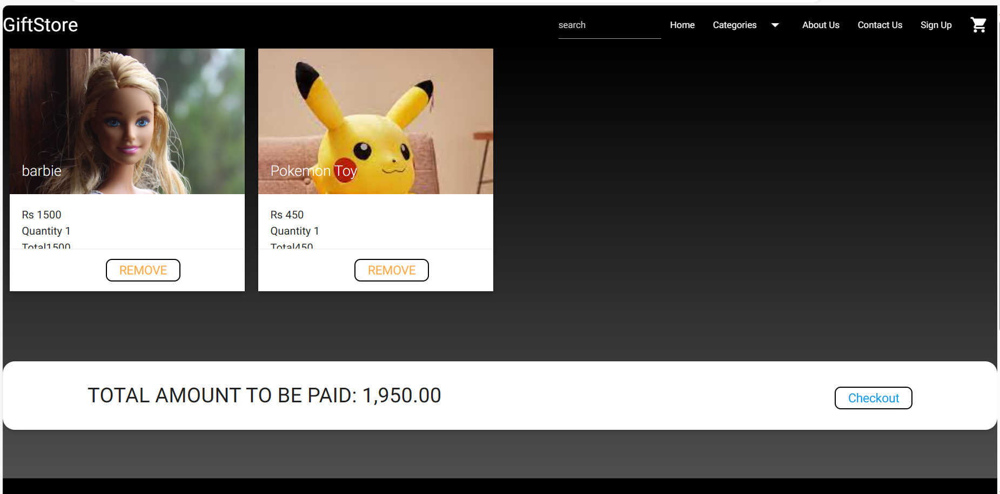
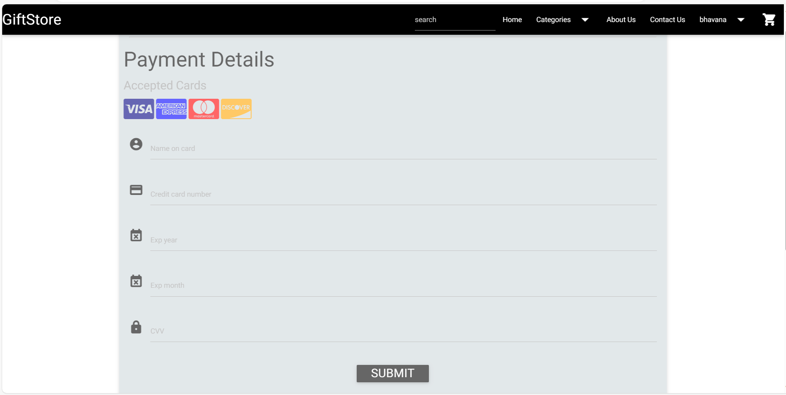

# Online-Gift-store-Website
Online Gift store website created using basic PHP, SQL, HTML, CSS, Materialize CSS . You can use XAMPP server to run the Website.  
**Description:** 
Onine Giftstore is a website created using Materialize CSS,Javascript,jquery,PHP and Mysql. 
This website provides several features such as various gift categories from which users can select the products, shopping cart, checkout, login/SignUp, email module, searchig,etc. 
Giftstore consistes of 8 categories such as crockery, watches, wallets, homedecore, phonecases, jewellery, kids and soft toys from which customers can select products and add to the cart.
  
**Requirements:** 
To run this website on your machine you need to install anyone server such as WAMP, LAMP or XAMPP.  
**Steps:** 
1)Download and install XAMPP server and download the files of this project 
2)Start XAMMP. Start Apache and SQL server. Go to phpmyadmin and create a new database named 'giftstore' 
3)Go to the giftstore database created and click on 'Import' option in the top menu
4)Upload the giftstore.sql file and import it
5)Open your web browser and check if you got the website running on your localhost (http://localhost/project_folder_name/)
6)Run index.php on localhost  
**ScreenShots:**  
**1)Front Page:  
  
  
2)Sign Up:  
  
3)Contact Us:  
  
4)Gift Categories:  
  
  
5)Shopping Cart:  
  
6)Checkout:  
  

## Authors
- [Mekala Bhavana](https://github.com/MEKALA-BHAVANA)

